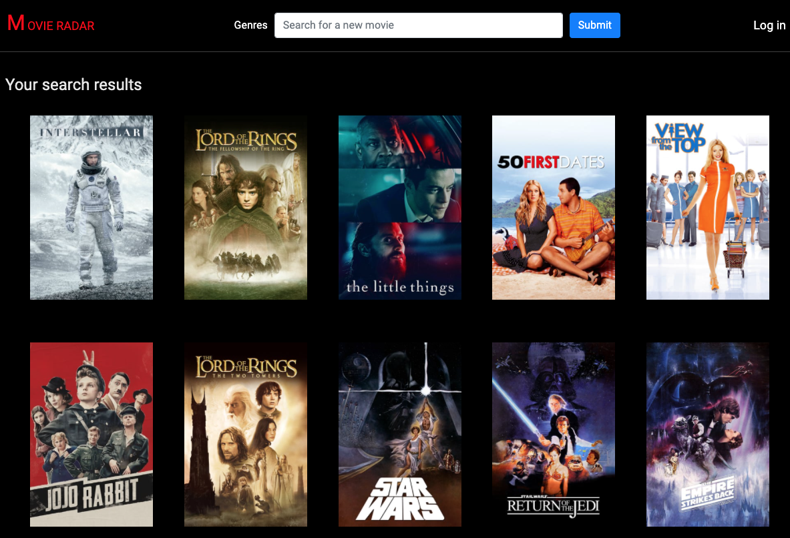
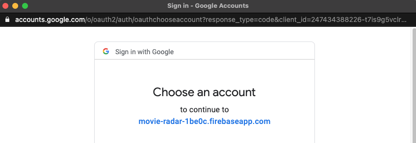
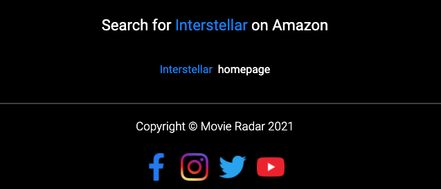
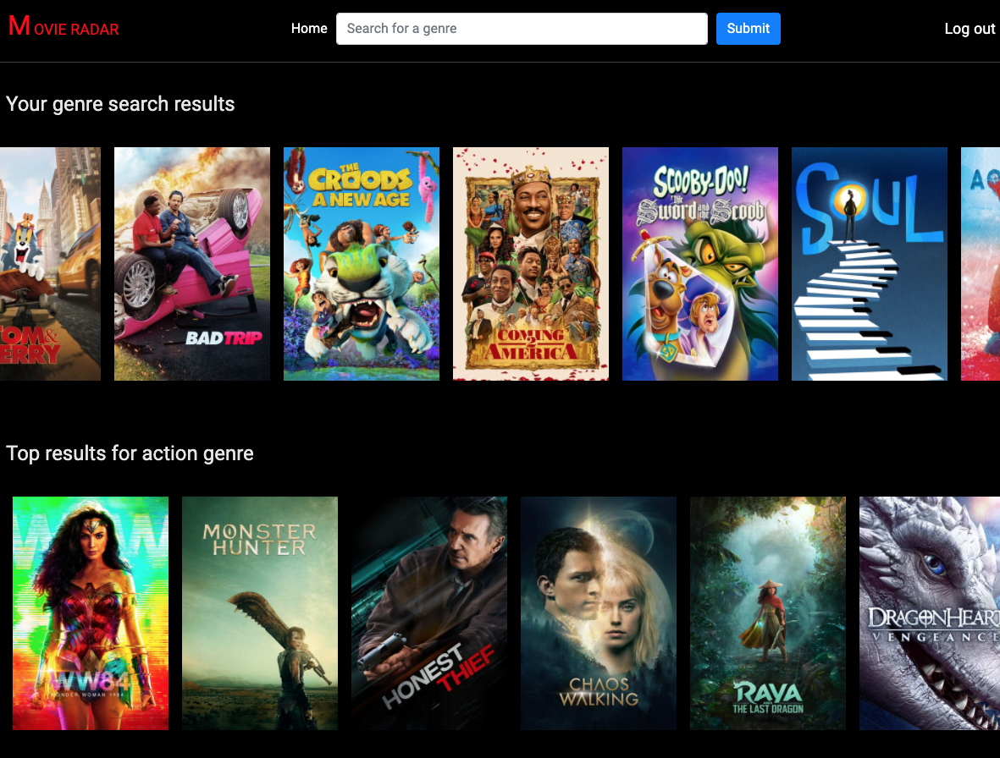

# 🎬 Movie Radar 🎥
Web application where users can create new movie entries through the integrated search engine. Give it a go in the "Getting Started" section below! 

---

## ⚙️ Technologies Used ⚙️

- MongoDB
- Mongoose
- dotenv
- Express.js
- Node.js
- React
- Bootstrap
- YouTube npm package
- The Movie Database API
- Heroku (for deployment)

---

## 📸 Screenshots of the deployed app 🏞

Home page where anyone can see movies that have been created

Nav bar for navigation throughout the app

Google Firebase authentication

"Search" bar used to create new movie entries

Movie show view 

Embedded YouTube player with the movie's trailer

Links to the movie on [Amazon](https://www.amazon.com) and the movie's homepage

Genre show page

---
## 🍿 Getting Started 🍿
- Click [here](https://movie-radar-heroku.herokuapp.com/) to access the Movie Radar app. 
- Users who are not logged in will be able to see previously created data in the browser, but will have no ability to create. 
- Users who are logged in are able to use the search bar to query [The Movie Database API](https://developers.themoviedb.org/3/getting-started) in order to create new entries in Movie Radar's database.
  - All you need to do to create a new entry is search for your favorite movie title! Please be specific :) 
- If you're feeling saucy, head over to the genre index page by clicking on the "Genre" link next to the search bar, and search for your favorite genre! 
  - p.s. Don't be surprised if you find that multiple entries are created this way!
- To view a movie's show page, simply click on the movie's poster.
- Enjoy all of the fun information and movie trailer at your fingertips!
- Don't forget to log out 👍

---
## Unsolved Problems
- Currently, the home page search bar only gets the first result from tMDB api, and does not work as a search function. It is more of a create function. 
- When a user searches for new genres, their searches are appended to the end of the already-existing "genre search results" carousel.
  - This is, unfortunately, not dynamic.
- There are currently two separate pages with separate search bars that perform different functions.  

---
## Future Enhancements
- Add the ability for users to create reviews for movies in the show view and to star their favorite movies. 
- Add a proper search bar that filters through the already created movies. 
- Refactor this code down to a single home page with ability to choose between different "search" (create) input fields. 